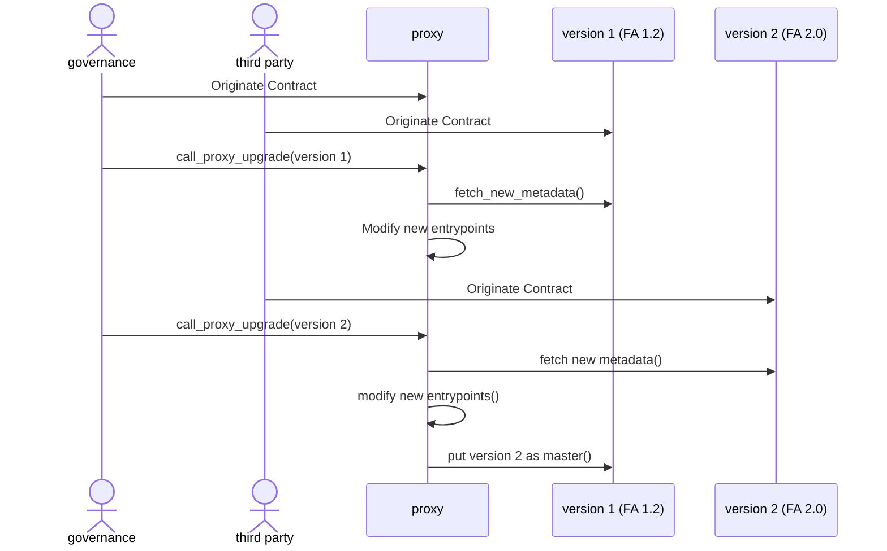
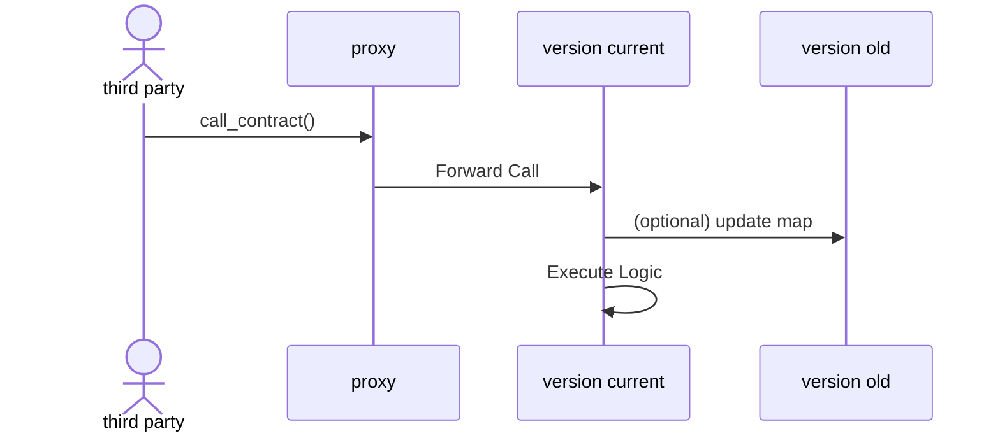

# TEZOS TZIP-018 : A2 - Upgradable Contracts

## Table Of Contents

<!-- TOC -->

- [Table Of Contents](#table-of-contents)
- [Summary](#summary)
- [Motivation](#motivation)
- [Abstract](#abstract)
- [Architecture](#abstract)

<!-- /TOC -->

## Summary

TZIP-018 proposes a set of mechanisms for defining upgradeable contracts with fixed address. We describe how to define administrator-forced upgrades about the logic and user-defined upgrades about the data.

We present here a POC as an upgrade of a FA12 coin to a FA2 coin, with metadata update and an increase of precision x1000 in the decimals while remaining the same supply.

### Using the TZIP18 framework

### Calling a TZIP18 contract

## Motivation

This proposal describes how to implement patterns for upgradeable contracts, providing :

1. Security : During the past several years, bugs and vulnerabilities in smart contracts caused millions of dollars to get stolen or lost forever. Such cases may even require manual intervention in blockchain operation to recover the funds. As a result, the community starts to acknowledge the need for upgradeable smart-contracts.

2. Adding features : Having logic fixed at origination makes the contract somehow wobbly. To unleach the true potential of Tezos framework, this is an important question to answer.

3. Version management : Tzip18 automaticaly manages differents versions and contract interconnections.

4. Fixed entrypoints : Callees like light clients, wallet and explorer can call a same entrypoint again and again, totaly separating the logic from the address.

5. Hot fixes : This proposal is convenient for fixing critical bugs or when a vulnerability is discovered in the contract's implementation, since a new version can quickly be released.

## Abstract

Implementing an upgradeable contract is not a trivial task, there are many considerations to address, such as address immutability and trust between users and administrators.

Here we present contracts capable of being upgraded by an administrator, without the users' consent, whilst retaining the existing contract's address. We call these "administrator-forced upgrades". The user will call the same proxy contract, and will be automaticaly lazily upgraded.

The design proposed for administrator-forced upgrades supports:
* adding/removing entrypoints
* changing an entrypoint's code and parameter type
* changing the storage's content and type
* address immutability (i.e. the proxy address does not change upon being upgraded)

Thanks to address immutability, this mechanism facilitates pushing upgrades to all users without requiring them to update the contract's address in their wallets.

Administrator-forced upgrades are not applicable to some use-cases because they require a certain degree of trust in the person or organization that manages the contract. In that particular case, people using the token must vote on the contract upgrade, or the architecture presented here must be slightly modified. This proposal does not cover this case. The administration problem is in fact totaly independant from the TZIP18 proposal, so in this POC we will only present a basic governance of only one user. Of course in a real project, a governance smart-contract must be created.

